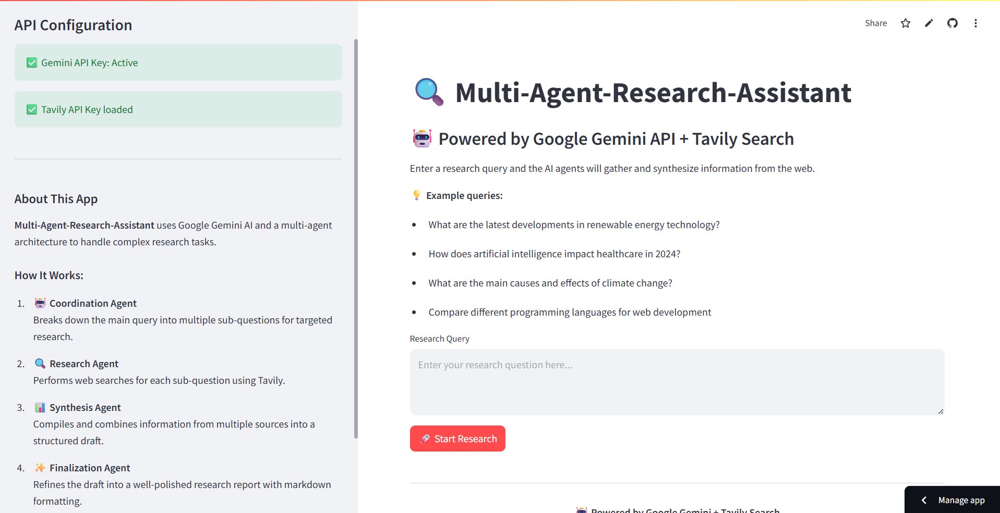

# 🔍 Multi-Agent Research Assistant


A powerful, AI-powered research tool that uses **Google Gemini 1.5 Flash** and **Tavily Search API** to perform intelligent, multi-step research through a modular, multi-agent architecture.

---

## 🚀 Features

- 🤖 **Multi-Agent AI System** (Coordination → Research → Synthesis → Finalization)
- 🔎 Real-time web search using Tavily
- 🧠 AI generation powered by `gemini-1.5-flash-latest`
- 📄 Markdown-formatted, downloadable final reports
- 🖥️ Interactive Streamlit interface

---

## 🧠 How It Works


1. **Coordination Agent** – Breaks your query into sub-questions
2. **Research Agent** – Uses Tavily API to search the web for each question
3. **Synthesis Agent** – Merges findings into a draft
4. **Finalization Agent** – Cleans and polishes the result using Gemini

---

## 📸 Screenshots

### 🏠 Home Page


---

### 📋 Research Plan


---

### 🔗 Sources Collected


---

### 🎯 Final Answer


---

### 📥 Download Report


---

## ⚙️ Setup Instructions

### 🔑 API Keys Required

Create a file at `.streamlit/secrets.toml` with:

```toml
GEMINI_API_KEY = "your_google_gemini_api_key"
TAVILY_API_KEY = "your_tavily_api_key"
```
Gemini model used: gemini-1.5-flash-latest

---

### 📦 Install Dependencies


```bash
pip install -r requirements.txt
```
###▶️ Run the App

```bash
streamlit run app.py
```

---

### 🙌 Credits

This project was built using:

- **[Streamlit](https://streamlit.io/)** – for building the web interface
- **[Google Gemini (gemini-1.5-flash-latest)](https://makersuite.google.com/app)** – for powerful AI reasoning and generation
- **[Tavily Search API](https://www.tavily.com/)** – for real-time web search results
- **[Pydantic](https://docs.pydantic.dev/)** – for managing agent state with data validation
- **[Python](https://www.python.org/)** – the programming language behind it all

Special thanks to the open-source community and AI researchers contributing to accessible AI tools.

---
